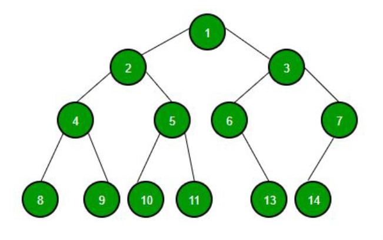
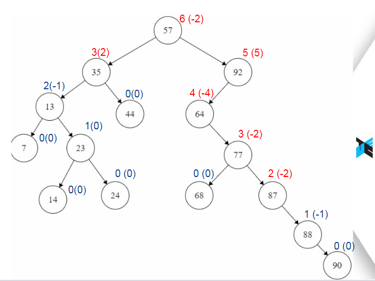

# Binary-Search-Tree-and-AVL-Tree
Implementation of Binary Search Tree and AVL Tree
## Integrantes:
- Fabryzzio Jossue Meza Torres
- Fernando Alonso Usurin Arias
- Yoselyn Victoria Miranda Chirinos
## Binary Search Tree

## AVL Tree

## Referencia APA
- Presentación 06(AVL).(2024). Ojeda,B., **Algoritmo y estructura de datos: CS2023** (págs. 1-23).UTEC
- Presentación 05(BST).(2024). Ojeda,B., **Algoritmo y estructura de datos: CS2023** (págs. 1-25).UTEC
